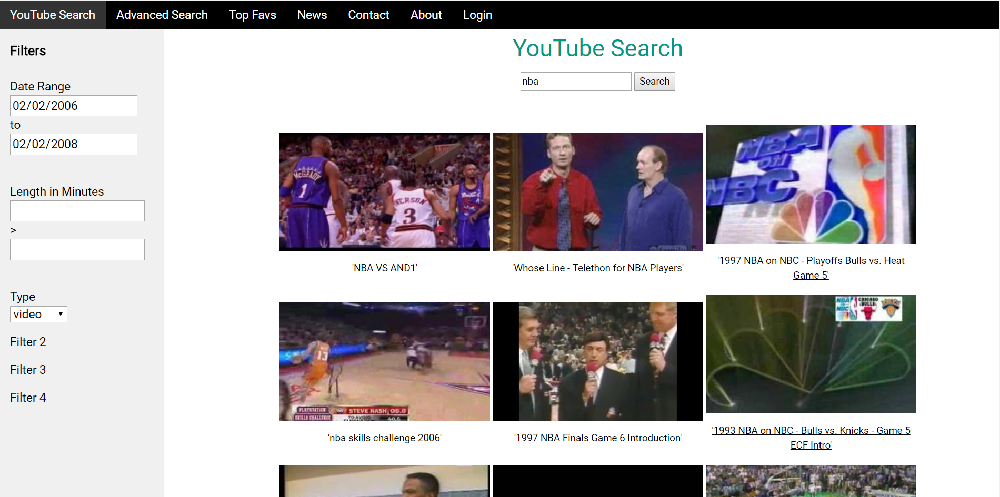
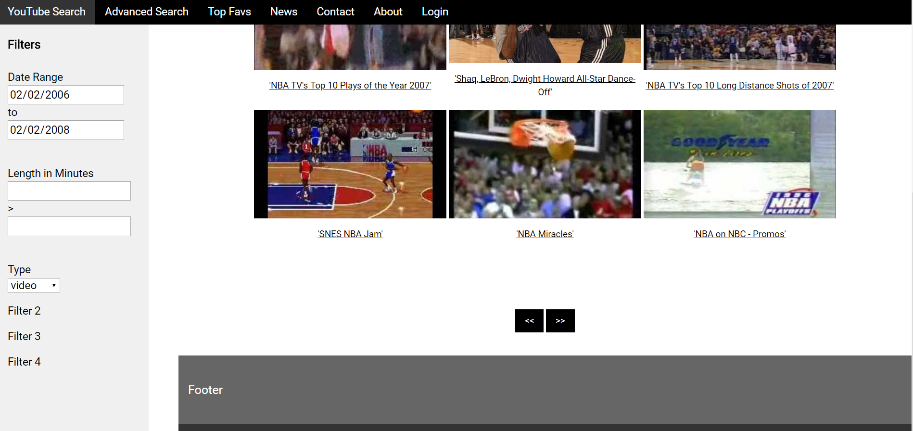

# YouTube Advanced Search

Advanced searches that cannot be done on the main YouTube site. Takes advantage of YouTube Data API. Uses Node.js and Express.js. Currently being developed.

# Running

1. Make sure Node.js v8.11.1 is installed (node -v).
2. Install packages
   - npm install express --save
   - npm install body-parser
   - youtube-node
3. Create config.json with this content:
   `{ "yt_key": "YOUR_KEY_HERE" }`
4. Start the application with "node server.js".
5. Open “http://localhost:3000” in browser.

# Status

Just forked this for personal use

# Screens

